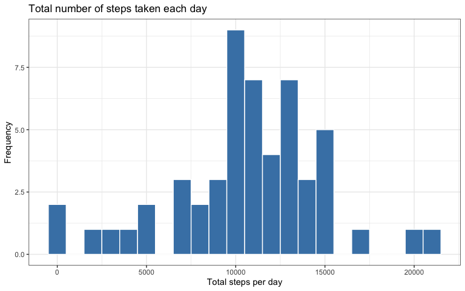
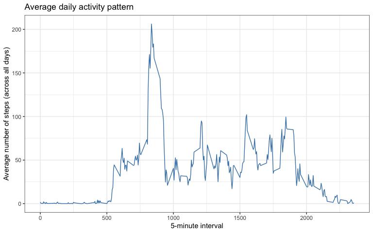
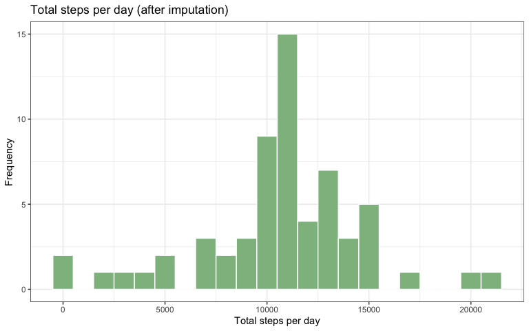
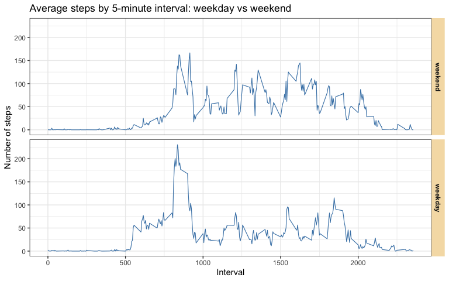

``` r
library(ggplot2)
```

## Loading and preprocessing the data

### (a) Load the data

The activity monitoring data are read from the CSV file bundled in `activity.zip` in this repository (equivalent to using `read.csv()` on the extracted file).


``` r
activity <- read.csv(unz("activity.zip", "activity.csv"), stringsAsFactors = FALSE)
```

### (b) Process/transform the data

The `date` variable is stored as character in the CSV; it is converted to `Date` for time-based summaries and for determining weekdays versus weekends later.


``` r
activity$date <- as.Date(activity$date)
str(activity)
```

```
## 'data.frame':	17568 obs. of  3 variables:
##  $ steps   : int  NA NA NA NA NA NA NA NA NA NA ...
##  $ date    : Date, format: "2012-10-01" "2012-10-01" ...
##  $ interval: int  0 5 10 15 20 25 30 35 40 45 ...
```

``` r
head(activity)
```

```
##   steps       date interval
## 1    NA 2012-10-01        0
## 2    NA 2012-10-01        5
## 3    NA 2012-10-01       10
## 4    NA 2012-10-01       15
## 5    NA 2012-10-01       20
## 6    NA 2012-10-01       25
```

## What is mean total number of steps taken per day?

Missing `steps` values are excluded when computing each day’s total (equivalent to ignoring `NA` when summing).


``` r
daily_total <- aggregate(steps ~ date, data = activity, FUN = sum, na.rm = TRUE)
head(daily_total)
```

```
##         date steps
## 1 2012-10-02   126
## 2 2012-10-03 11352
## 3 2012-10-04 12116
## 4 2012-10-05 13294
## 5 2012-10-06 15420
## 6 2012-10-07 11015
```

### (a) Histogram of total steps per day


``` r
ggplot(daily_total, aes(x = steps)) +
  geom_histogram(binwidth = 1000, fill = "steelblue", color = "white") +
  labs(
    title = "Total number of steps taken each day",
    x = "Total steps per day",
    y = "Frequency"
  ) +
  theme_bw()
```

<!-- -->

### (b) Mean and median total steps per day


``` r
mean_steps_day <- mean(daily_total$steps)
median_steps_day <- median(daily_total$steps)
```

The **mean** total number of steps taken per day is 10,766.19.

The **median** total number of steps taken per day is 10,765.

## What is the average daily activity pattern?

### (a) Time series of average steps by 5-minute interval

For each 5-minute `interval`, the average number of steps is computed across all days (missing values ignored when averaging).


``` r
interval_avg <- aggregate(steps ~ interval, data = activity, FUN = mean, na.rm = TRUE)

ggplot(interval_avg, aes(x = interval, y = steps)) +
  geom_line(linewidth = 0.5, color = "steelblue") +
  labs(
    title = "Average daily activity pattern",
    x = "5-minute interval",
    y = "Average number of steps (across all days)"
  ) +
  theme_bw()
```

<!-- -->

### (b) Interval with the maximum average steps


``` r
max_row <- interval_avg[which.max(interval_avg$steps), ]
max_interval <- max_row$interval
max_avg_steps <- max_row$steps
```

On average across all days, the **maximum** activity occurs in interval **835**, where the average number of steps is **206.17**.

## Imputing missing values

### (a) Number of missing values


``` r
n_missing <- sum(is.na(activity$steps))
```

The total number of rows with missing `steps` is **2,304**.

### (b) Imputation strategy

Missing values are replaced by the **mean number of steps for that same 5-minute interval**, averaged across all days where that interval was observed (the same interval averages used in the “average daily activity pattern” section). This keeps the daily shape of activity stable and uses information from non-missing intervals.


``` r
interval_means <- aggregate(steps ~ interval, data = activity, FUN = mean, na.rm = TRUE)
```

### (c) New dataset with imputed values


``` r
activity_imputed <- activity
na_idx <- is.na(activity_imputed$steps)
activity_imputed$steps[na_idx] <-
  interval_means$steps[match(activity_imputed$interval[na_idx], interval_means$interval)]
sum(is.na(activity_imputed$steps))
```

```
## [1] 0
```

### (d) Histogram and summaries after imputation; comparison to Part 2


``` r
daily_total_imp <- aggregate(steps ~ date, data = activity_imputed, FUN = sum)
mean_imp <- mean(daily_total_imp$steps)
median_imp <- median(daily_total_imp$steps)
```


``` r
ggplot(daily_total_imp, aes(x = steps)) +
  geom_histogram(binwidth = 1000, fill = "darkseagreen", color = "white") +
  labs(
    title = "Total steps per day (after imputation)",
    x = "Total steps per day",
    y = "Frequency"
  ) +
  theme_bw()
```

<!-- -->

After imputation, the **mean** total steps per day is 10,766.19 and the **median** is 10,766.19.

Compared with Part 2 (mean 10,766.19, median 10,765), the estimates after imputation are shown below.


``` r
comparison <- data.frame(
  statistic = c("Mean", "Median"),
  original = c(mean_steps_day, median_steps_day),
  imputed = c(mean_imp, median_imp)
)
comparison
```

```
##   statistic original  imputed
## 1      Mean 10766.19 10766.19
## 2    Median 10765.00 10766.19
```

**Impact of imputing missing data:** Replacing missing intervals with the mean for that interval adds steps on days that had missing readings, so daily totals on those days increase. The histogram of daily totals reflects more complete data; the **mean** total steps per day typically shifts more than the **median**, which is less sensitive to changes in the tails. After imputation, the mean changes by 0 steps and the median by 1.19 steps relative to Part 2.

## Are there differences in activity patterns between weekdays and weekends?

Analysis uses `activity_imputed`. Weekend versus weekday is determined in a **locale-independent** way using `POSIXlt` weekday codes (Saturday and Sunday).


``` r
wd <- as.POSIXlt(activity_imputed$date)$wday ## 0 = Sunday, 6 = Saturday
activity_imputed$daytype <- factor(
  ifelse(wd == 0 | wd == 6, "weekend", "weekday"),
  levels = c("weekend", "weekday")
)
table(activity_imputed$daytype)
```

```
## 
## weekend weekday 
##    4608   12960
```

Average steps by interval and day type:


``` r
interval_daytype <- aggregate(
  steps ~ interval + daytype,
  data = activity_imputed,
  FUN = mean
)
```

Panel plot (reference style: two stacked panels, interval on the x-axis, average steps on the y-axis):


``` r
ggplot(interval_daytype, aes(x = interval, y = steps)) +
  geom_line(color = "steelblue", linewidth = 0.4) +
  facet_grid(daytype ~ .) +
  labs(
    x = "Interval",
    y = "Number of steps",
    title = "Average steps by 5-minute interval: weekday vs weekend"
  ) +
  theme_bw() +
  theme(
    strip.background = element_rect(fill = "wheat", color = NA),
    strip.text = element_text(face = "bold")
  )
```

<!-- -->

**Interpretation:** Weekends and weekdays show different shapes and levels of activity across the day (for example, morning peaks versus more activity spread across weekend intervals). The faceted plot makes those differences easy to compare.
